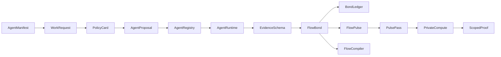
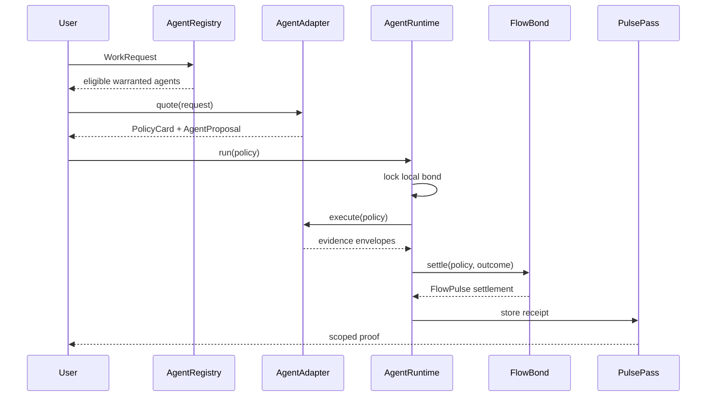
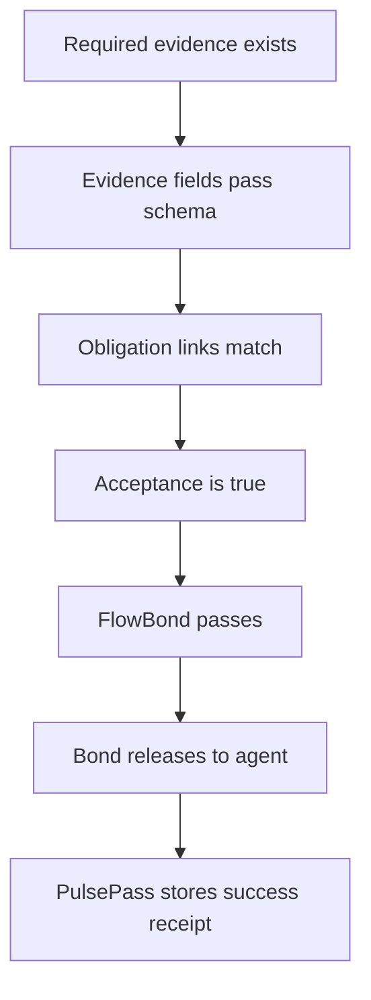
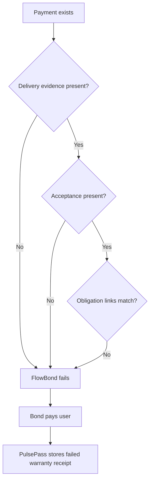

# Architecture Diagrams

## Framework Stack



Core idea:

```text
The agent promise becomes a warranted machine history.
```

## Runtime Sequence



## Success Path



## Failure Path



## Boundary

These diagrams describe the local deterministic framework. They do not claim production custody, wallet enforcement, production verifier infrastructure, production settlement, zero-knowledge privacy, or work-quality proof.
